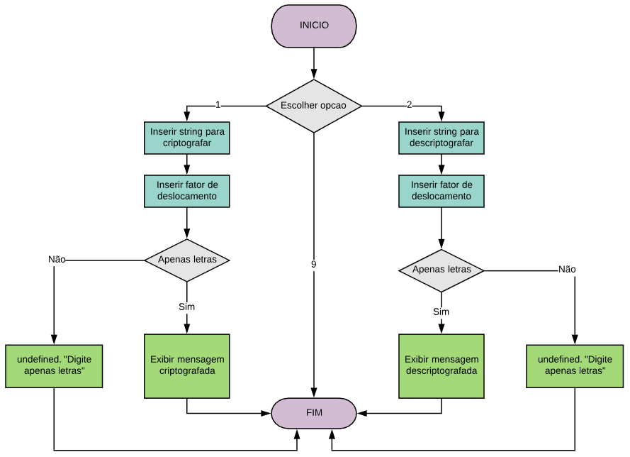

# CIFRA DE CÉSAR
## Descrição do projeto
  A cifra de César consiste em uma criptografia simples. É um tipo de cifra de substituição na qual cada letra do texto é substituída por outra letra baseado em um número fixo de deslocamento. Nessa aplicação existem duas opções: CRIPTOGRAFAR e DESCRIPTOGRAFAR, que apresenta o resultado com base no número de deslocamento. 
  Observação: Os espaços são substituídos por "#".
  
## Instruções de uso:
  Ao iniciar a aplicação, será apresentado as seguintes opções:
  1 - Criptografar
  2 - Descriptografar
  9 - Sair 
  Ao digitar a opção 1 ou 2, será solicitado a frase que deseja criptografar ou descriptografar, e em seguida um número inteiro para deslocamento. Após inserido, será apresentado o resultado e a frase original digitada.
  Ao digitar a opção 9, a aplicação será finalizada.
  Qualquer caracter além das três opções apresentadas (1, 2, 9), não será aceita. 
 
## Fluxograma:

## Pseudocódigo:
>Algoritmo "caesarCipher"  
>// Autor   : Letícia Faria  
>//------------------------------------------------------------------------------------  
>  
>Funcao cipher() :  
>var  
>  message : (leia("O que deseja criptografar?"));  
>  displacement : (leia("Qual o fator de deslocamento?"));  
>  cipherMessage : vetor  
>  toASCII, letter : inteiro  
>inicio  
>  se message não for "" e displacement nao for NaN e message for apenas letras entao  
>    para i <- 0 de i ate message.tamanho passo i++ faca  
>      toASCII <- copia message[i].charCodeAt  
>      se toASCII >= 65 e toASCII <= 90 entao  
>        letter <- copia (toASCII - 65 + displacement) %  26 + 65;  
>        cipherMessage <- copia String.fromCharCode(letter)  
>      se toASCII >= 97 e toASCII <= 122 entao  
>        letter <- copia (toASCII - 97 + displacement) %  26 + 97;  
>        cipherMessage <- copia String.fromCharCode(letter)  
>      se toASCII == 32 entao  
>        letter <- 35  
>        cipherMessage <- copia String.fromCharCode(letter)  
>      fimse  
>    fimpara  
>  
>    var result <- copia escreva "A sua mensagem criptografada com um deslocamento de " + displacement + " é: " + cipherMessage.join("")  
>    retorna result  
>  se message == "" entao  
>    escreva "Campo da string vazia!"  
>  se displacement for NaN  
>    escreva "Campo de fator de deslocamento vazio!"  
>  senao  
>    escreva undefined + "Digite apenas letras!"  
>  fimse  
>FimFuncao  
>  
>  
>Funcao decipher() :  
>var  
>  message : (leia("O que deseja descriptografar?"));  
>  displacement : (leia("Qual o fator de deslocamento?"));  
>  cipherMessage : vetor  
>  toASCII, letter : inteiro  
>inicio  
>  se message não for "" e displacement nao for NaN e message for apenas letras entao  
>    para i <- 0 de i ate message.tamanho passo i++ faca  
>      toASCII <- copia message[i].charCodeAt  
>      se toASCII >= 65 e toASCII <= 90 entao  
>        letter <- copia (toASCII - 90 - displacement) %  26 + 90;  
>        cipherMessage <- copia String.fromCharCode(letter)  
>      se toASCII >= 97 e toASCII <= 122 entao  
>        letter <- copia (toASCII - 122 - displacement) %  26 + 122;  
>        cipherMessage <- copia String.fromCharCode(letter)  
>      se toASCII == 35 entao  
>        letter <- 32  
>        cipherMessage <- copia String.fromCharCode(letter)  
>      fimse  
>    fimpara  
>  
>    var result <- copia escreva "A sua mensagem criptografada com um deslocamento de " + displacement + " é: " + cipherMessage.join("")  
>    retorna result  
>  se message == "" entao  
>    escreva "Campo da string vazia!"  
>  se displacement for NaN  
>    escreva "Campo de fator de deslocamento vazio!"  
>  senao  
>    escreva undefined + "Digite apenas letras!"  
>  fimse  
>FimFuncao  
>FimAlgoritmo  